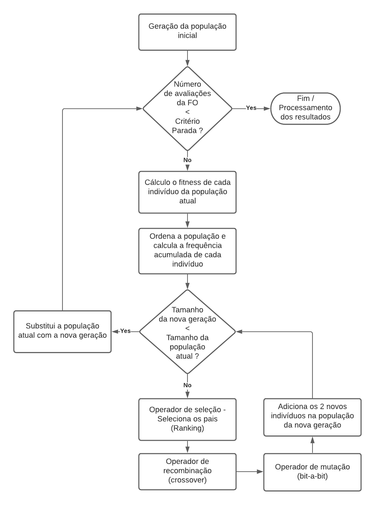

# Algoritmo Genético Simples

* **Disciplina:** CMC-324-4 - Otimização Evolutiva
* **Docente:** Dr. Fabiano Luis de Sousa

________________________________________________________

## Descrição da Tarefa

**Implementação de um SGA com as seguintes características:**
- Codificação binária
- Seleção da população intermediária (pais) por meio da "roda da roleta"
- Crossover de um ponto
- Mutação bit-a-bit
- Substituição da população: Geracional

## Parâmetros de Ajuste
- **Obrigatórios:**
    - Tamanho da população (Np)
    - Probabilidade de crossover (Pc)
    - Probabilidade de mutação (Pm)
- **Adicionado:**
    - Tamanho do genótipo
    - Número de avaliações da função objetivo como critério de parada
    - Lista contendo cada NFOB a mostrar o melhor fitness

## Fluxograma

   

## Trabalhos Futuros
   * Incluir variável que descreve se o ótimo é máximo ou mínimo.
   * Alteração do cálculo de frequência acumulada em problema de maximização visando adicionar a roda da roleta.