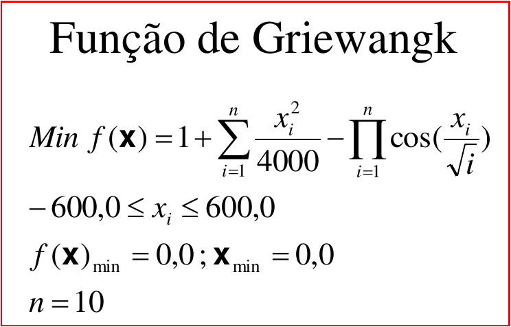
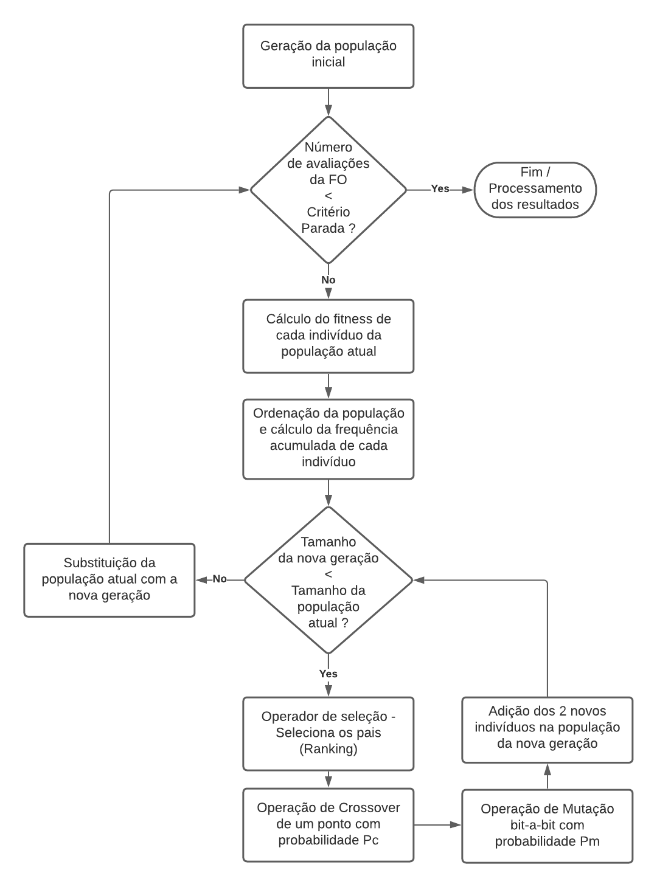

# Algoritmo Genético Simples

 

* **Instituto:** Instituto Nacional de Pesquisas Espaciais
* **PPG:** Engenharia e Tecnologia Espaciais - Engenharia e Gerenciamento de Sistemas Espaciais
* **Disciplina:** CMC324-4 - Otimização Evolutiva
* **Docente:** Dr. Fabiano Luis de Sousa

### Sumário
- [Descrição da Tarefa](https://github.com/leobeckerdaluz/SGA_OtimizacaoEvolutiva#descri%C3%A7%C3%A3o-da-tarefa)
- [Parâmetros de Ajuste](https://github.com/leobeckerdaluz/SGA_OtimizacaoEvolutiva#par%C3%A2metros-de-ajuste)
- [Fluxograma da Execução](https://github.com/leobeckerdaluz/SGA_OtimizacaoEvolutiva#fluxograma-da-execu%C3%A7%C3%A3o)
- [Passo a Passo para Executar](https://github.com/leobeckerdaluz/SGA_OtimizacaoEvolutiva#passo-a-passo-para-executar)
- [Implementações Futuras](https://github.com/leobeckerdaluz/SGA_OtimizacaoEvolutiva#implementa%C3%A7%C3%B5es-futuras)

________________________________________________________

## Descrição da Tarefa
**Implementação de um SGA com as seguintes características:**
- Codificação binária
- Seleção da população intermediária (pais) por meio da "roda da roleta" **(O problema de minimização --> Seleção por ranking)**
- Crossover de um ponto
- Mutação bit-a-bit
- Substituição da população: Geracional

**Função objetivo:**

   

## Parâmetros de Ajuste
- **Parâmetros de Ajuste do Algoritmo:**
    - Tamanho da população (Np)
    - Probabilidade de crossover (Pc)
    - Probabilidade de mutação (Pm)
    - Tamanho do cromossomo
    - Número de avaliações da função objetivo (Critério de parada)
- **Parâmetros de Execução:**
    - Lista contendo valores de NFOB. Quando o algoritmo atinge cada um desses números de avaliações da função objetivo, o melhor valor da execução até o momento é armazenada (Lista de valores retornada ao final da execução).

## Fluxograma da Execução

   

## Passo a Passo para Executar
### Alteração dos parâmetros de ajuste e de execução
Para alterar os parâmetros de ajuste e de execução do código, é necessário abrir o código fonte em um editor de texto e realizar a alteração dos valores das variáveis.
### Execução
- **Linux (Arch Linux / Manjaro):**
   - **Requisitos:** É necessário instalar o pacote **`dotnet-sdk`**. Por sua vez, esse pacote instala juntamente todos os pacotes necessários para o seu funcionamento.
   - **Execução:** Acesse a pasta **`/SGA`** deste repositório e digite no terminal **`dotnet run`**. Esse comando compila o código e executa.
- **Windows:** 
   - **Requisitos:** É necessário instalar alguma versão do **Visual Studio** para a execução do projeto.
   - **Execução:** Acesse a pasta **`/SGA`** deste repositório e execute o arquivo **`SGA.cs`**
- **Online:** 
   - É possível utilizar um compilador C# online para executar a aplicação. Para isso, é necessário abrir o código fonte em um editor e copiá-lo. A seguir, acesse o site [.NET Fiddle](https://dotnetfiddle.net/) e cole o código lá. Então é só executar.

## Implementações Futuras
   * Adição de controle para quando o problema é de maximização ou de minimização
   * Alteração do cálculo de frequência acumulada em problema de maximização, visando adicionar a roda da roleta.