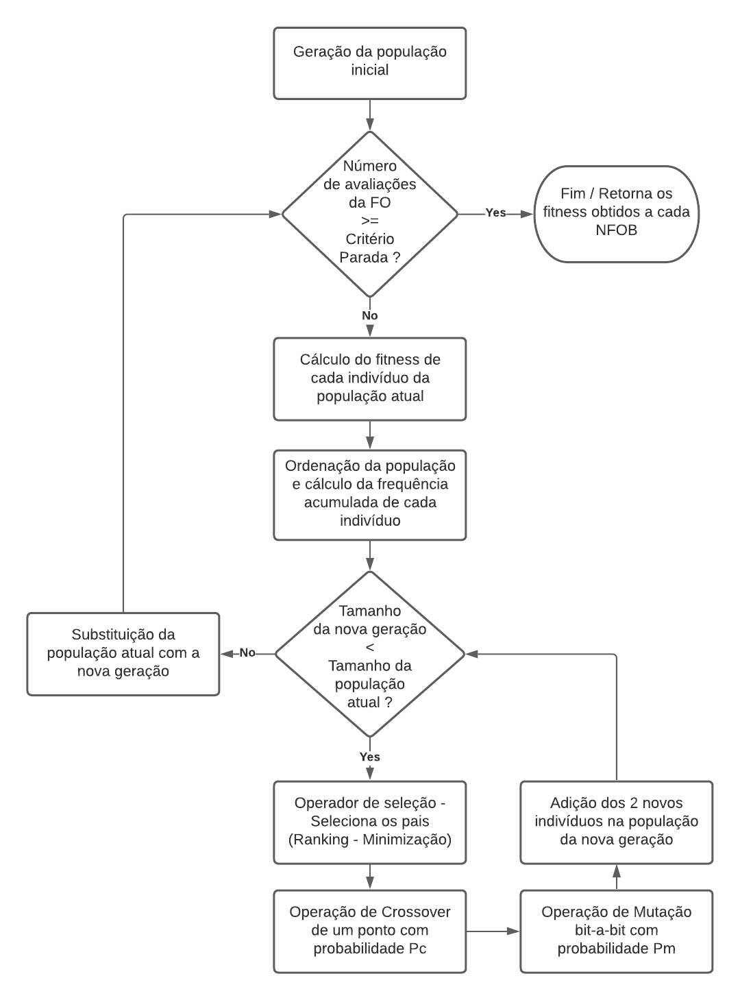

# Algoritmo Genético Simples

* **Disciplina:** CMC-324-4 - Otimização Evolutiva
* **Docente:** Dr. Fabiano Luis de Sousa

________________________________________________________

## Descrição da Tarefa
**Implementação de um SGA com as seguintes características:**
- Codificação binária:
- Seleção da população intermediária (pais) por meio da "roda da roleta"
- Crossover de um ponto
- Mutação bit-a-bit
- Substituição da população: Geracional

**Função objetivo:**

   

## Parâmetros de Ajuste
- **Parâmetros de Ajuste do Algoritmo:**
    - Tamanho da população (Np)
    - Probabilidade de crossover (Pc)
    - Probabilidade de mutação (Pm)
    - Tamanho do cromossomo
    - Número de avaliações da função objetivo (Critério de parada)
- **Parâmetros de Execução:**
    - Lista contendo valores de NFOB. Quando o algoritmo atinge cada um desses números de avaliações da função objetivo, o melhor valor da execução até o momento é armazenada (Lista de valores retornada ao final da execução).

## Fluxograma da Execução

   

## Implementações Futuras
   * Adição de controle para quando o problema é de maximização ou de minimização
   * Alteração do cálculo de frequência acumulada em problema de maximização visando adicionar a roda da roleta.